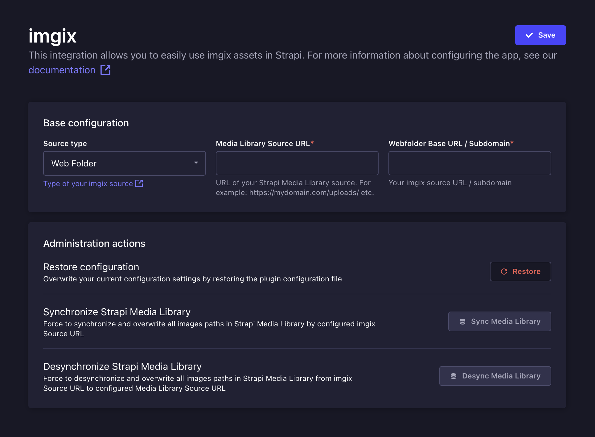
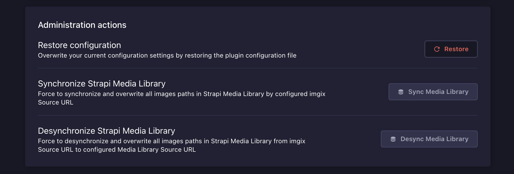

<!-- ix-docs-ignore -->


A Strapi Plugin to integrate [imgix](www.imgix.com) with your Strapi Media Library.

[](https://www.npmjs.com/package/strapi-plugin-imgix)
[](https://circleci.com/gh/imgix/strapi-plugin-imgix)

<!-- [](https://www.npmjs.com/package/@imgix/strapi-plugin-imgix) -->

[](https://github.com/imgix/strapi-plugin-imgix/blob/main/LICENSE.md)

<!-- [](https://github.com/prettier/prettier) -->
<!-- [](https://app.fossa.com/projects/git%2Bgithub.com%2Fimgix%2Fstrapi-plugin-imgix?ref=badge_shield) -->

---

<!-- prettier-ignore-start -->

<!-- toc -->


### Table of Contents

1. [Versions](#versions)
2. [Features](#features)
3. [Requirements](#requirements)
4. [Installation](#installation)
5. [Configuration](#configuration)
   - [imgix configuration](#imgix-configuration)
   - [Settings page configuration](#settings-page-configuration)
   - [File configuration file](#file-configuration)
   - [Security Middleware Configuration](#security-middleware-configuration)
6. [Rendering images](#rendering-images)
7. [Contributing](#contributing)

<!-- tocstop -->

<!-- prettier-ignore-end -->

## Versions
- **Strapi v5** - (current) [v2.x](https://github.com/imgix/strapi-plugin-imgix)
- **Strapi v4** - [v1.x](https://github.com/imgix/strapi-plugin-imgix/tree/v4)

## Features

### Serve Strapi assets from an imgix Source

If you manage your assets using Strapi's built-in Media Library, this plugin allows you to rewrite the asset URLs so that they are served from an imgix Source.

#### Integration with Strapi Upload Providers

If your imgix Source is configured with a storage provider like Amazon S3, you can use this plugin to configure the Strapi Media Library to fetch assets directly from your imgix Source. You should also configure the corresponding Strapi Upload [Provider](https://market.strapi.io/providers).


## Requirements

Complete installation requirements are exact same as for Strapi itself and can be found in the documentation under [Installation Requirements](https://docs.strapi.io/developer-docs/latest/getting-started/introduction.html).

**Minimum environment requirements**

- Node.js `>=18.0.0 <=20.x.x`
- NPM `>=6.x.x`

In our minimum support we're following [official Node.js releases timelines](https://nodejs.org/en/about/releases/).

**Supported Strapi versions**:

- Strapi v5.0.0-rc.23 (recently tested)
- Strapi v5.x

## Installation

### From the Strapi Marketplace

As a **verified** Strapi plugin, we're available on the [**Strapi Marketplace**](https://market.strapi.io/plugins/strapi-plugin-imgix) as well as **In-App Marketplace** where you can follow the installation instructions.

### From the command line

You can install this plugin from NPM within your Strapi project.

```bash
yarn add strapi-plugin-imgix@latest
```

Once installed, you must re-build your Strapi instance.

```bash
yarn build
yarn develop
```

Alternatively, you can run Strapi in the development mode with `--watch-admin` option:

```bash
yarn develop --watch-admin
```

The **imgix** plugin will appear in the **Plugins** section of Strapi sidebar after the app rebuilds.

You can now [configure](#configuration) the plugin.

## Configuration

To use the **imgix plugin**, you must first [create an **imgix account**](https://docs.imgix.com/getting-started/setup/quick-start-guide) and [Source](https://docs.imgix.com/getting-started/setup/creating-sources) if you haven't already.

Then you can configure your Strapi instance using the [dedicated Settings page](#settings-page-configuration).

### imgix configuration

1. [Create an account](https://docs.imgix.com/getting-started/setup/quick-start-guide)
2. [Setup source](https://docs.imgix.com/getting-started/setup/creating-sources)
3. [(optional) Create token / API key](https://dashboard.imgix.com/api-keys) - Required for non-webfolder source types. **Ensure that the generated key has the following permission: `Sources`**

### Settings page configuration

You can access the configuration page via `Strapi Settings -> Section: IMGIX Plugin -> Configuration`.

You must specify following properties:

- Source - `Webfolder` or `Other` (S3, Azure, R2, etc)
- Media Library Source URL - Example: `http://localhost:1337/uploads/`
- imgix Source URL - Example: `https://sdk-test.imgix.net`

When using `Other` source types, you must fill our the [Source ID](https://docs.imgix.com/apis/management/overview#making-requests) and [API Key](https://dashboard.imgix.com/api-keys) fields. This enables the plugin to [purge](https://docs.imgix.com/apis/management/purges) and [add](https://docs.imgix.com/apis/management/assets#adding-an-asset) assets using the **imgix Management API**.

<div style="margin: 20px 0" align="center">
  
</div>

**How Asset URL Paths Get Re-Written**

Once you've configured the plugin it automatically rewrites the URLs of your assets to point to the imgix URL. For example, if you have an image at `https://mydomain.com/uploads/amsterdam.jpg`, the plugin will rewrite the URL to `https://sdk-test.imgix.net/amsterdam.jpg`. You must configure your imgix source to point into the **resources path** of your web folder, like `/uploads`.

> [!NOTE]
> Default configuration for your plugin is fetched from `config/plugins.{js,ts}` or directly from the plugin itself. To customize the default state to revert to, see the [file configuration](#file-configuration) section.

### File configuration

If you do net yet have a `config/plugins.{js,ts}` or `config/<env>/plugins.{js,ts}` file, create it manually.

Otherwise, add the `imgix` config to the existing `plugins` configurations.

```ts
// config/plugins.{js,ts}

module.exports = ({ env }) => ({
  //...
  'imgix': {
    enabled: true,
    config: {
        mediaLibrarySourceUrl: '<MEDIA SOURCE OF YOUR PROVIDER OR YOUR DOMAIN>', // Example: https://my-awss3-bucket-for-strapi.s3.eu-central-1.amazonaws.com/ or https://mydomain.com/uploads/
        apiKey: '<YOUR IMGIX API KEY / TOKEN HERE>',
        source: {
            type: '<SOURCE TYPE>' // 'other' or 'webfolder'. Default: 'other'
            id: '<SOURCE ID STRING>', // Example:
            url: '<IMGIX SOURCE URL>', // Example: https://sdk-test.imgix.net
        },
    },
  },
  //...
});
```

See Strapi plugin configuration [documentation](https://docs.strapi.io/dev-docs/configurations/plugins) for more information.

### Security Middleware Configuration

The default settings of the **Strapi Security Middleware** will not allow you to display uploaded images thumbnails directly in the **Media Library** interface. You will need to modify the `contentSecurityPolicy` settings by replacing `strapi::security` string with the object bellow instead.

```ts
// config/middlewares.{js,ts}

module.exports = [
  // ...
  {
    name: "strapi::security",
    config: {
      contentSecurityPolicy: {
        useDefaults: true,
        directives: {
          "connect-src": ["'self'", "https:"],
          "img-src": [
            "'self'",
            "data:",
            "blob:",
            "market-assets.strapi.io",
            "<IMGIX SOURCE URL>", // Example: https://sdk-test.imgix.net
          ],
          "media-src": [
            "'self'",
            "data:",
            "blob:",
            "market-assets.strapi.io",
            "<IMGIX SOURCE URL>", // Example: https://sdk-test.imgix.net
          ],
          upgradeInsecureRequests: null,
        },
      },
    },
  },
  // ...
];
```

#### Properties

- `mediaLibrarySourceUrl` - url of your local / provider image source of _Strapi Media Library_. Example: `http://localhost:1337/public/images/`
- `apiKey` - **imgix** Management API Key ([setup](https://dashboard.imgix.com/api-keys))
- `source.id` - your **imgix** source id as a 24-character string ([setup](https://docs.imgix.com/apis/management/overview#making-requests))
- `source.url` - you **imgix** source url / subdomain. Example: `https://sdk-test.imgix.net`

## Administration actions

<div style="margin: 20px 0" align="center">
  
</div>

Plugin provides bunch of administration actions you can perform.

- **Restore configuration** - you're forcing plugin to get configuration from the `config/plugins.{js,ts}` or `config/<env>/plugins.{js,ts}` file and overwrite current settings.
- **Sync Media Library** - Assets existing in Strapi Media Library are forced to work with the plugin. Their paths are overwritten based on current plugin configuration, like *Media Library Source URL* →  *Source URL / Subdomain*.
- **Desync Media Library** - Assets existing in Strapi Media Library are forced work with your configured provider. Their paths are overwritten back based on current plugin configuration, like *Source URL / Subdomain* →  *Media Library Source URL*.

## Rendering images

Images provided by the Strapi Media Library with imgix Integration Plugin runing enables you to use the full set of **imgix** functionalities out of the box using a Render API query parameters or SDKs.

### Rendering API

See the full documentation **[here](https://docs.imgix.com/apis/rendering/overview)**

### SDK

**imgix** support multiple different frontend libraries by ready to use SDKs, like:

- JavaScript
- React
- Vue
- and more.

To get the full list please check the dedicated **[Libraries directory](https://docs.imgix.com/libraries)**.

## Contributing

### Development

1. Clone repository

   ```
   git clone git@github.com:imgix/strapi-plugin-imgix.git
   ```

2. Run install & develop build command

   ```ts
   // Install all dependencies
   yarn install

   // Watch for file changes
   yarn develop

   // or run build without nodemon
   yarn build
   ```

3. Create a soft link in your strapi project to plugin build folder

   ```sh
   ln -s <your path>/strapi-plugin-imgix/dist <your path>/strapi-project/src/plugins/imgix
   ```

4. Modify `config/plugins.{js,ts}` for `imgix`

```js
//...
'imgix': {
  enabled: true,
  resolve: './src/plugins/imgix',
  //...
}
//...
```

5. Run your Strapi instance

